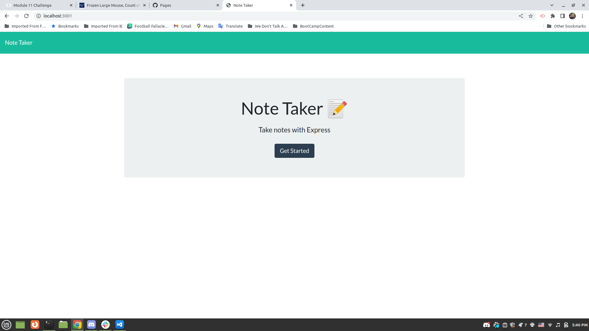
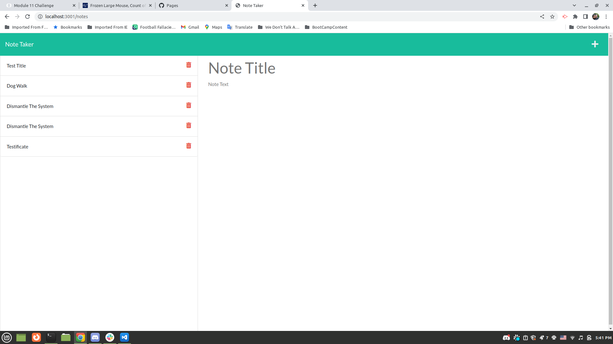
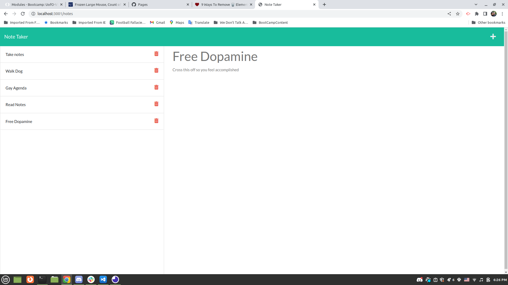
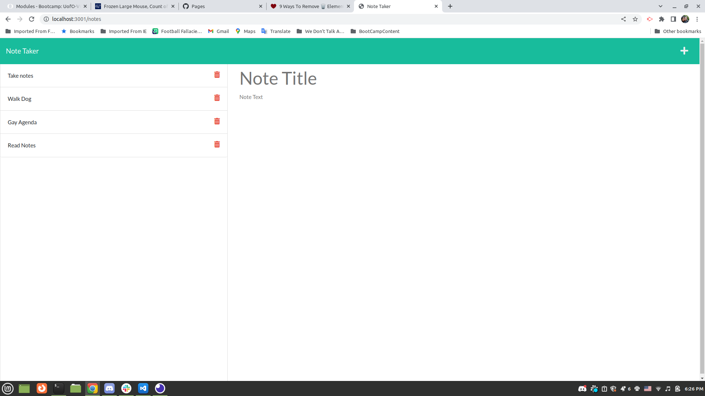

# Note Taker Starter Code

## Description

A note taker that saves each note into an api. Notes save and can be deleted from the API.

## Table of Contents

* [Installation](#Installation)
* [Usage](#Usage)
* [Questions](#Questions)

## Installation

Install node and express.

## Usage

Run 'node index' in the command line

# Images

## Contributing 

Me (and also the starter code provided by Bootcamp)

## Questions

If you have additional questions, please reach me at slorreina369@gmail.com or slorreina369 on GitHub.